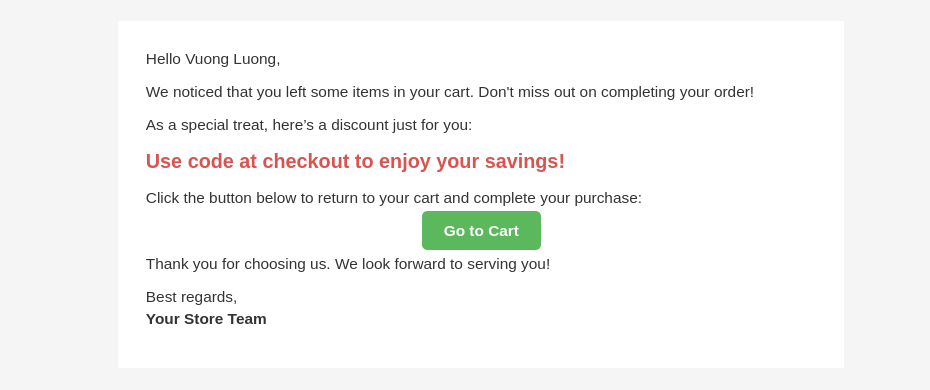

# Thao_CartAbandonment

Magento 2 module for tracking and recovering abandoned carts.

## System Requirements

- Magento 2.4+
- PHP 7.4+

## Installation

### Install via Composer

1. Add the repository to Composer:
   ```sh
   composer config repositories.thao/module-cart-abandonment git https://github.com/Tothao/Thao_CartAbandonment.git
   ```
2. Install the module:
   ```sh
   composer require thao/module-cart-abandonment:dev-master
   ```
3. Run the following commands to enable the module:
   ```sh
   php bin/magento setup:upgrade
   php bin/magento setup:di:compile
   php bin/magento cache:flush
   ```

### Manual Installation

1. Clone the module from GitHub:
   ```sh
   git clone https://github.com/Tothao/Thao_CartAbandonment.git app/code/Thao/CartAbandonment
   ```
2. Run the following commands to enable the module:
   ```sh
   php bin/magento setup:upgrade
   php bin/magento setup:di:compile
   php bin/magento cache:flush
   ```
## Configuration Guide

To configure the module, go to **Admin > Configuration > Thaott > Cart Abandonment > General Configuration**.

### Available Settings:

- **Module Enable:** Enable/disable the module.
- **Abandonment Time Threshold (Hours):** Enter the number of hours after which a cart is considered abandoned. For example, enter 24 for 1 day.
- **Abandoned Cart Email Template:** Select an email template to send notifications to customers.
- **Abandoned Cart Discount Rule:** Choose a predefined Cart Price Rule to generate coupon codes for abandoned cart customers.
- **Abandoned Cart Alert Schedule:**
    - Example: `*/10 * * * *`
    - Enter a cron expression to schedule the abandoned cart alert.
    - Example: `*/10 * * * *` runs the alert every 10 min.
    - Refer to [crontab.guru](https://crontab.guru/) for more information.




## Support

If you encounter any issues or have questions, please create an issue on the module's GitHub repository.

## License

This module is released under the proprietary license.
